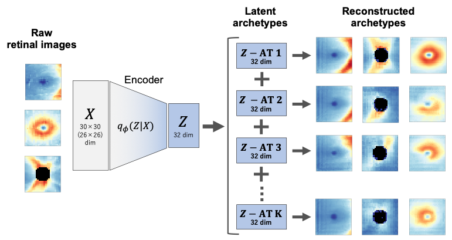

# Latent Retinal Archetype



## Overview

This repository provides an implementation of the Latent Retinal Archetype framework, which identifies characteristic patterns (archetypes) in high-dimensional retinal imaging data. 

By embedding retinal measurements into a latent space and decomposing them into a small set of archetypal components, this method enables:

## Installation

```bash
git clone https://github.com/keimy1007/RetinalArchetype.git
cd RetinalArchetype
conda env create -f environment.yml
conda activate RetinalArchetype
```

## Usage


## Reference
- Latent retinal structural patterns with aging
https://www.nature.com/articles/s41746-025-01632-z

- harvard GDP repository
https://github.com/Harvard-Ophthalmology-AI-Lab/Harvard-GDP

- harvard GDP paper
https://openaccess.thecvf.com/content/ICCV2023/papers/Luo_Harvard_Glaucoma_Detection_and_Progression_A_Multimodal_Multitask_Dataset_and_ICCV_2023_paper.pdf

## Author
Kei Sano (@keimy1007)
KeimyInJapan
